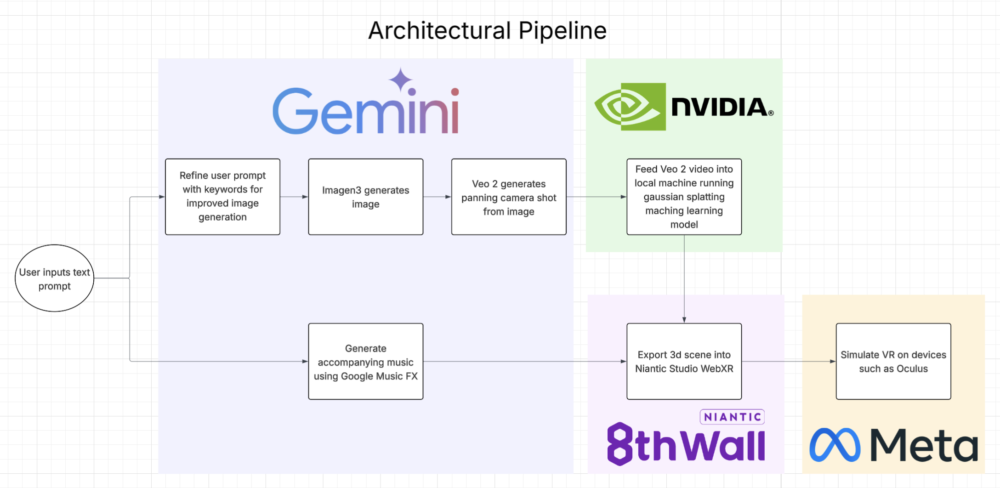

# 🐌 SlugMeditate

*Transforming calm thoughts into immersive VR journeys.*

SlugMeditate is a calming VR experience that turns your thoughts into immersive worlds. Just type in a peaceful idea, and we use AI to generate visuals, turn them into video, and transform it into a 3D scene you can explore in virtual reality — all in your browser. It’s like a personalized meditation space, built from your own imagination.

## 🌟 Inspiration

We wanted to explore how emerging generative AI and VR technologies could support mindfulness and mental well-being. Many college students deal with stress and burnout — what if we could turn a simple reflection or intention into a deeply personal, calming VR experience?

Thus, **SlugMeditate** was born: a pipeline that transforms your thoughts into a 3D ambient escape.

## ✨ What It Does

SlugMeditate takes a **text input** (like _"a peaceful forest at dusk"_) and transforms it into:

1. **Image Generation** – Using **Google Imagen 3**, powered by **Google AI Gemini**, we generate visually rich and vivid images from the user’s prompt.
2. **Video Creation** – These images are animated into smooth, cinematic video loops using **Google AI Gemini Veo 2**.
3. **3D Scene Mapping** – The generated video is converted into a volumetric 3D scene using **Gaussian Splatting**.
4. **VR Immersion** – We render the 3D environment in-browser using **Niantic Studio WebXR**, paired with ambient music for a fully immersive and relaxing VR experience.
5. **Ambient Music Generation** – Using **Google MusicFX**, we generate peaceful background music tailored to your prompt, completing the meditative vibe.

## 🧠 How We Built It

- **Text-to-Image**: Generated with **Imagen 3**, part of **Google AI Gemini**'s generative capabilities.
- **Image-to-Video**: Animated using **Gemini AI Veo 2** for cinematic smoothness and style.
- **3D Reconstruction**: Used **Gaussian Splatting** to map video into a navigable 3D environment.
- **VR Deployment**: Built and displayed the immersive world using **Niantic Studio WebXR**.
- **Sound Design**: Integrated calming ambient tracks to enhance the meditative experience.

## 🧗 Challenges We Ran Into

- A lot of the **API documentation for Google tools** (like Imagen 3 and Veo 2) was either outdated or didn’t work as expected, so we had to piece things together from multiple sources and experiment through trial and error.
- We tried multiple methods of **Gaussian Splatting**, but hit limitations due to **hardware constraints** and time.
- It was tricky to get the **image-to-video prompting** just right. If the camera motion didn’t pan correctly or stayed too static, the 3D reconstruction would break or look flat.
- We were all **new to Niantic Studio WebXR**, so learning the ecosystem and figuring out how to display our 3D scene in a browser-based VR environment took some digging.
- **CruzHacks had unreliable Wi-Fi**, which made working with cloud-based AI tools extra tough — we had to sync and generate assets whenever the connection let us.

## 🏆 Accomplishments We're Proud Of

- Built a complete **text-to-VR pipeline** using cutting-edge generative AI in under 48 hours.
- Successfully integrated **Google AI Gemini** tools with VR rendering frameworks.
- Created an emotionally resonant experience combining creativity, tech, and wellness.
- Learned and operationalized advanced tools like **Imagen 3**, **Veo 2**, and **Gaussian Splatting** quickly.

## 📚 What We Learned

- Practical use of **Google AI Gemini** for generative media workflows.
- How to bridge AI media generation with 3D spatial computing and VR rendering.
- Rapid prototyping, team collaboration, and problem-solving under pressure.

## 🔮 What's Next

- **Interactive environments** – Let users explore within the VR space.
- **Customization** – Personalize music, ambient sounds, or guided meditations.
- **Performance tuning** – Reduce generation and render time for real-time feedback.
- **Community gallery** – Share and explore others' meditative scenes.

---

> Built with love, curiosity, and caffeine by the **SlugMeditate** team at CruzHacks 2025   
> Powered by **Google AI Gemini**, **Niantic Studio WebXR**, and **Gaussian Splatting**.

Docker Setup:
1. Run `docker build -t python-env .`
2. docker run -it --rm -v "$(your path to directory):/app" python-env
	- for mac: docker run -it --rm -v "$PWD:/app" python-env
	- windows: docker run -it --rm -v "/$(pwd | sed 's/^C:\\//; s/\\/\//g'):/app" python-env